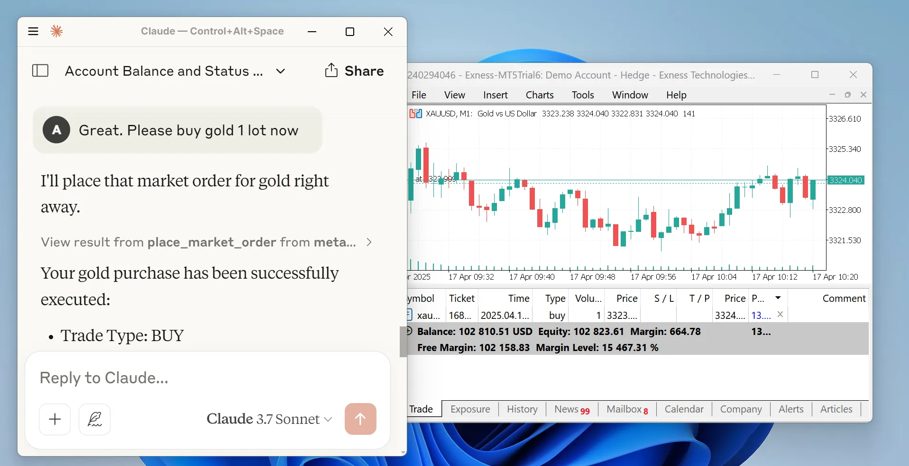

# MetaTrader MCP Server

[](https://pypi.org/project/metatrader-mcp-server/)
[](https://www.python.org/downloads/)
[](https://opensource.org/licenses/MIT)

**Bridge between AI assistants and MetaTrader 5.** Talk to Claude, ChatGPT, or any LLM in natural language to execute trades, check balances, and stream market data — all routed through MT5.



```
You  →  AI Assistant  →  MCP Server  →  MetaTrader 5  →  Your Trades
```

---

## ⚠️ Disclaimer

Trading involves significant risk of loss. This software is provided as-is with **no liability** for trading outcomes. You are responsible for all trades executed through this system. **This is not financial advice.**

---

## Prerequisites

- **Python 3.10+** — [Download](https://www.python.org/downloads/)
- **MetaTrader 5 terminal** — [Download](https://www.metatrader5.com/en/download)
- **MT5 account credentials** — Login number, password, and server name (e.g. `MetaQuotes-Demo`)
- **Algo trading enabled** — In MT5: `Tools → Options → Expert Advisors → Allow algorithmic trading`

## Installation

```bash
pip install metatrader-mcp-server
```

---

## Quick Start

Choose the interface that fits your use case:

### Option A — Claude Desktop (MCP over stdio)

Add to your Claude Desktop config (`%APPDATA%\Claude\claude_desktop_config.json` on Windows, `~/Library/Application Support/Claude/claude_desktop_config.json` on Mac):

```json
{
  "mcpServers": {
    "metatrader": {
      "command": "metatrader-mcp-server",
      "args": [
        "--login",     "YOUR_MT5_LOGIN",
        "--password",  "YOUR_MT5_PASSWORD",
        "--server",    "YOUR_MT5_SERVER",
        "--transport", "stdio"
      ]
    }
  }
}
```

Restart Claude Desktop, then try: *"What's my account balance?"*

> **Custom MT5 path?** Add `"--path", "C:\\Program Files\\MetaTrader 5\\terminal64.exe"` to the args array.

### Option B — Remote MCP Server (SSE)

Run the MCP server on a Windows VPS where MT5 is installed, then connect to it remotely.

**Server side:**

```bash
metatrader-mcp-server --login YOUR_LOGIN --password YOUR_PASSWORD --server YOUR_SERVER
# Defaults to SSE on 0.0.0.0:8080. Customize with --host and --port.
```

**Client side** (Claude Desktop config):

```json
{
  "mcpServers": {
    "metatrader": {
      "url": "http://VPS_IP:8080/sse"
    }
  }
}
```

> **Security note:** MCP has no built-in auth. Use a firewall, reverse proxy with auth, or SSH tunnel when exposing over a network.

### Option C — REST API (for Open WebUI / ChatGPT)

```bash
metatrader-http-server --login YOUR_LOGIN --password YOUR_PASSWORD --server YOUR_SERVER --host 0.0.0.0 --port 8000
```

API docs available at `http://localhost:8000/docs`. In Open WebUI: `Settings → Tools → Add Tool Server → http://localhost:8000`.

### Option D — WebSocket Quote Stream

Stream live tick data for dashboards, bots, or monitoring:

```bash
metatrader-quote-server --login YOUR_LOGIN --password YOUR_PASSWORD --server YOUR_SERVER
# Defaults to ws://0.0.0.0:8765
```

Connect with any WebSocket client:

```bash
websocat ws://localhost:8765
```

See [WebSocket Details](#websocket-quote-server) below.

---

## IDE Integration Guide

This MCP server works with any IDE that supports the Model Context Protocol. Below are setup instructions for popular editors.

### Cursor

Cursor supports MCP via a `mcp.json` config file.

**Global** (all projects): `~/.cursor/mcp.json`
**Per-project**: `.cursor/mcp.json` in your project root

```json
{
  "mcpServers": {
    "metatrader": {
      "command": "metatrader-mcp-server",
      "args": [
        "--login",     "YOUR_MT5_LOGIN",
        "--password",  "YOUR_MT5_PASSWORD",
        "--server",    "YOUR_MT5_SERVER",
        "--transport", "stdio"
      ]
    }
  }
}
```

**Steps:**
1. Create/edit the config file at one of the paths above
2. Replace credentials with your MT5 account details
3. Restart Cursor
4. Verify in **Settings → Tools & MCP** — the server should show a green status indicator
5. Open a chat and ask: *"What's my account balance?"*

> For a remote SSE server, replace `command`/`args` with `"url": "http://YOUR_VPS_IP:8080/sse"`.

---

### VS Code (GitHub Copilot)

VS Code uses `.vscode/mcp.json` for MCP configuration with GitHub Copilot agent mode.

**Workspace** (per-project): `.vscode/mcp.json` in your project root
**Global**: Open Command Palette (`Ctrl+Shift+P`) → `MCP: Open User Configuration`

```json
{
  "servers": {
    "metatrader": {
      "command": "metatrader-mcp-server",
      "args": [
        "--login",     "YOUR_MT5_LOGIN",
        "--password",  "YOUR_MT5_PASSWORD",
        "--server",    "YOUR_MT5_SERVER",
        "--transport", "stdio"
      ],
      "type": "stdio"
    }
  }
}
```

**Steps:**
1. Create `.vscode/mcp.json` in your project root (or use the global config)
2. Replace credentials with your MT5 account details
3. Reload the VS Code window (`Ctrl+Shift+P` → `Developer: Reload Window`)
4. Verify in the **Output** panel → select **MCP** from the dropdown
5. Switch Copilot Chat to **Agent Mode** and ask: *"Show my open positions"*

> **Note:** VS Code uses `"servers"` as the top-level key (not `"mcpServers"` like Claude/Cursor).

---

### Antigravity

Antigravity supports MCP servers via its built-in MCP Store or manual config.

**Option 1 — MCP Store (recommended):**
1. Open the agent panel (side panel)
2. Go to **Manage MCP Servers** or **Settings → Integrations**
3. Click **Open MCP Config** (or "View raw config")
4. Add the server config (see below)

**Option 2 — Manual config file:**

Edit `~/.gemini/config/mcp_config.json` (global) or `.agents/mcp_config.json` (per-project):

```json
{
  "mcpServers": {
    "metatrader": {
      "command": "metatrader-mcp-server",
      "args": [
        "--login",     "YOUR_MT5_LOGIN",
        "--password",  "YOUR_MT5_PASSWORD",
        "--server",    "YOUR_MT5_SERVER",
        "--transport", "stdio"
      ]
    }
  }
}
```

**Steps:**
1. Add the config via the MCP Store UI or edit the JSON file directly
2. Replace credentials with your MT5 account details
3. The server should appear in the MCP servers list
4. Start a chat and ask: *"What symbols are available?"*

---

### Quick Reference

| IDE | Config File | Top-Level Key | Transport |
|-----|------------|---------------|-----------|
| Claude Desktop | `claude_desktop_config.json` | `mcpServers` | stdio / SSE |
| Cursor | `.cursor/mcp.json` | `mcpServers` | stdio / SSE |
| VS Code | `.vscode/mcp.json` | `servers` | stdio / http |
| Antigravity | `mcp_config.json` | `mcpServers` | stdio / SSE |

## Configuration

### Environment Variables

Create a `.env` file instead of passing credentials on the command line:

```env
LOGIN=12345678
PASSWORD=your_password
SERVER=MetaQuotes-Demo

# Optional
# MT5_PATH=C:\Program Files\MetaTrader 5\terminal64.exe
# MCP_TRANSPORT=sse
# MCP_HOST=0.0.0.0
# MCP_PORT=8080
# QUOTE_HOST=0.0.0.0
# QUOTE_PORT=8765
# QUOTE_SYMBOLS=XAUUSD,USOIL,GBPUSD,USDJPY,EURUSD,BTCUSD
# QUOTE_POLL_INTERVAL_MS=100
```

### MCP Transport Options

| Flag | Env Var | Default | Description |
|------|---------|---------|-------------|
| `--transport` | `MCP_TRANSPORT` | `sse` | Transport: `sse`, `stdio`, `streamable-http` |
| `--host` | `MCP_HOST` | `0.0.0.0` | Bind host (SSE/HTTP only) |
| `--port` | `MCP_PORT` | `8080` | Bind port (SSE/HTTP only) |

### Quote Server Options

| Flag | Env Var | Default | Description |
|------|---------|---------|-------------|
| `--host` | `QUOTE_HOST` | `0.0.0.0` | Bind host |
| `--port` | `QUOTE_PORT` | `8765` | Bind port |
| `--symbols` | `QUOTE_SYMBOLS` | `XAUUSD,USOIL,GBPUSD,...` | Comma-separated symbols |
| `--poll-interval` | `QUOTE_POLL_INTERVAL_MS` | `100` | Poll interval (ms) |

CLI flags override env vars, which override defaults.

### Python Client Config

```python
config = {
    "login": 12345678,            # Required
    "password": "your_password",  # Required
    "server": "MetaQuotes-Demo",  # Required
    "path": None,                 # MT5 terminal path (auto-detect)
    "timeout": 60000,             # Connection timeout (ms)
    "portable": False,            # Portable mode
    "max_retries": 3,             # Retry attempts
    "backoff_factor": 1.5,        # Retry delay multiplier
    "cooldown_time": 2.0,         # Seconds between connections
    "debug": True,                # Debug logging
}
```

---

## Usage Examples

### Natural Language (via Claude)

> *"Show me my account information"* → Returns balance, equity, margin, leverage
>
> *"Buy 0.01 lots of GBP/USD with stop loss at 1.2500"* → Executes trade, confirms result
>
> *"Close all my losing positions"* → Closes positions, reports results
>
> *"Show me all my trades from last week for EUR/USD"* → Returns trade history

### REST API

```bash
curl http://localhost:8000/api/v1/account/info
curl "http://localhost:8000/api/v1/market/price?symbol_name=EURUSD"
curl http://localhost:8000/api/v1/positions

curl -X POST http://localhost:8000/api/v1/order/market \
  -H "Content-Type: application/json" \
  -d '{"symbol": "EURUSD", "volume": 0.01, "type": "BUY"}'
```

### Python Library

```python
from metatrader_client import MT5Client

client = MT5Client({"login": 12345678, "password": "pass", "server": "MetaQuotes-Demo"})
client.connect()

stats = client.account.get_trade_statistics()
price = client.market.get_symbol_price("EURUSD")
client.order.place_market_order(type="BUY", symbol="EURUSD", volume=0.01)

client.disconnect()
```

---

## API Reference

### Account

| Operation | Description |
|-----------|-------------|
| `get_account_info` | Balance, equity, profit, margin, leverage, currency |

### Market Data

| Operation | Description |
|-----------|-------------|
| `get_symbols` | List available symbols (with optional group filter) |
| `get_symbol_price` | Current bid/ask for a symbol |
| `get_symbol_info` | Detailed symbol metadata |
| `get_candles_latest` | Latest N candles (OHLCV) |
| `get_candles_by_date` | Historical candles for a date range |

### Orders

| Operation | Description |
|-----------|-------------|
| `place_market_order` | Instant BUY/SELL |
| `place_pending_order` | Limit/stop order at a future price |
| `modify_position` | Update SL/TP on an open position |
| `modify_pending_order` | Modify pending order parameters |
| `close_position` | Close a specific position |
| `close_all_positions` | Close all open positions |
| `close_all_positions_by_symbol` | Close all for a symbol |
| `close_all_profitable_positions` | Close only winners |
| `close_all_losing_positions` | Close only losers |
| `cancel_pending_order` | Cancel a specific pending order |
| `cancel_all_pending_orders` | Cancel all pending orders |
| `cancel_pending_orders_by_symbol` | Cancel pending orders for a symbol |

### Positions

| Operation | Description |
|-----------|-------------|
| `get_all_positions` | All open positions |
| `get_positions_by_symbol` | Filter by symbol |
| `get_positions_by_id` | Get by position ID |
| `get_all_pending_orders` | All pending orders |
| `get_pending_orders_by_symbol` | Filter pending by symbol |

### History

| Operation | Description |
|-----------|-------------|
| `get_deals` | Historical completed trades |
| `get_orders` | Historical order records |

---

## WebSocket Quote Server

Streams real-time tick data from MT5 over WebSocket.

### Message Format

**On connect:**
```json
{"type": "connected", "symbols": ["XAUUSD", "EURUSD"], "poll_interval_ms": 100}
```

**Tick updates** (sent on bid/ask/volume change):
```json
{"type": "tick", "symbol": "XAUUSD", "bid": 2345.67, "ask": 2345.89, "spread": 0.22, "volume": 1234, "time": "2026-03-14T10:30:45+00:00"}
```

**Errors:**
```json
{"type": "error", "symbol": "INVALID", "message": "Symbol not found or data unavailable"}
```

### Python Client Example

```python
import asyncio, json
from websockets.asyncio.client import connect

async def main():
    async with connect("ws://localhost:8765") as ws:
        async for message in ws:
            tick = json.loads(message)
            if tick["type"] == "tick":
                print(f"{tick['symbol']}: {tick['bid']}/{tick['ask']}")

asyncio.run(main())
```

### Design Notes

- **Change detection** — Only broadcasts when bid/ask/volume actually changes
- **Late joiners** — New clients get cached ticks immediately on connect
- **MT5 thread safety** — All SDK calls serialized through a single-thread executor
- **Multi-client** — Any number of WebSocket clients can connect

---

## Trading Assistant Skill

A pre-built skill for Claude Code / Claude Desktop is included in `claude-skill/`. It gives Claude structured knowledge about all trading tools, output formatting, and MT5 domain expertise.

**Install for Claude Code:**

```bash
cd metatrader-mcp-server
mkdir -p .claude
ln -s ../claude-skill .claude/skills
```

**Install for Claude Desktop:**

```bash
# macOS
cp -r claude-skill/trading ~/Library/Application\ Support/Claude/skills/trading

# Windows
xcopy /E claude-skill\trading "%APPDATA%\Claude\skills\trading\"
```

Once installed, use `/trading` or just ask trading questions naturally.

---

## Development

```bash
git clone https://github.com/ariadng/metatrader-mcp-server.git
cd metatrader-mcp-server
pip install -e .
pip install pytest python-dotenv
pytest tests/
```

### Project Structure

```
src/
├── metatrader_client/    # Core MT5 SDK wrapper (account, market, order, history, connection)
├── metatrader_mcp/       # MCP server (FastMCP, ~25 tools)
├── metatrader_openapi/   # REST API (FastAPI)
└── metatrader_quote/     # WebSocket quote streamer
```

---

## Troubleshooting

| Problem | Solution |
|---------|----------|
| Connection failed | Ensure MT5 is running, algo trading is enabled, credentials are correct |
| Module not found | Run `pip install metatrader-mcp-server`, verify Python ≥ 3.10 |
| Order execution failed | Verify symbol exists on your broker, market is open, sufficient margin |

